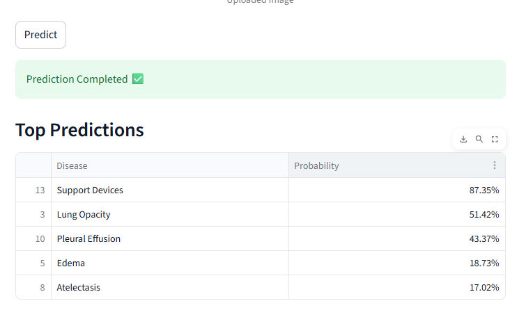
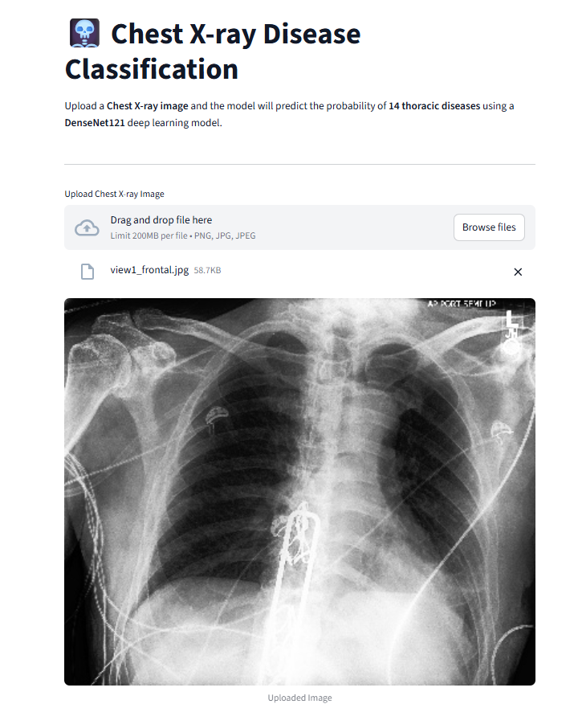

# 🩻 Chest X-ray Multi-Label Disease Classification

> End-to-End Deep Learning | Transfer Learning | Streamlit Deployment

<p align="center">
  
</p>

An end-to-end deep learning application for **multi-label chest X-ray disease classification** using **DenseNet121**, **TensorFlow**, and **Streamlit**.

---

## 🚀 Live Demo

🌐 https://seifzaki10--chest-x-ray-disease-classification-app-othksj.streamlit.app/

## 💻 GitHub Repository

https://github.com/SeifZaki10/Chest-Xray-Disease-Classification

---

## 📌 Project Overview

This project predicts multiple thoracic diseases from a single chest X-ray image using a **DenseNet121** model with **Transfer Learning**.

The project covers the complete deep learning workflow, including:

- Image preprocessing and resizing
- Data augmentation
- Multi-label target preparation
- Transfer Learning
- Feature Extraction
- Fine-Tuning
- Model training and evaluation
- Streamlit deployment

The web application allows users to upload a chest X-ray image and receive disease prediction probabilities through an interactive interface.

---

## ✨ Features

- Upload a chest X-ray image
- Predict probabilities for **14 thoracic diseases**
- Display the **Top 5 predictions**
- Interactive probability bar chart
- Complete probability table
- Simple and user-friendly Streamlit interface

---

## 🧠 Model

**Architecture**

- DenseNet121 (ImageNet Pretrained)

**Transfer Learning**

- Feature Extraction
- Fine-Tuning

**Task**

- Multi-label Image Classification

**Activation Function**

- Sigmoid

**Loss Function**

- Binary Cross-Entropy

---

## 📊 Dataset

The model was trained using the **NIH Chest X-ray Dataset**, which contains frontal chest X-ray images labeled with **14 thoracic disease classes** for multi-label classification.

---

## 🛠 Technologies

- Python
- TensorFlow / Keras
- Streamlit
- Plotly
- NumPy
- Pandas
- Pillow
- Git
- GitHub

---

## 📁 Project Structure

```text
.
├── app.py
├── utils.py
├── labels.py
├── best_model.keras
├── requirements.txt
├── images
│   ├── upload.png
│   └── prediction.png
├── README.md
└── Chest_Xray_Project.ipynb
```

---

## ▶️ Run Locally

```bash
git clone https://github.com/SeifZaki10/Chest-Xray-Disease-Classification.git

cd Chest-Xray-Disease-Classification

pip install -r requirements.txt

streamlit run app.py
```

---

## 📷 Application Demo

### Upload Chest X-ray

<p align="center">
  
</p>

### Prediction Results

<p align="center">
  
</p>

---

## ⚠️ Disclaimer

This project was developed for **educational and research purposes only** and **must not be used for medical diagnosis or clinical decision-making**.

---

## 👨‍💻 Author

**Seif Zaki**

- GitHub: https://github.com/SeifZaki10
- LinkedIn: https://www.linkedin.com/in/seif-zaki12/